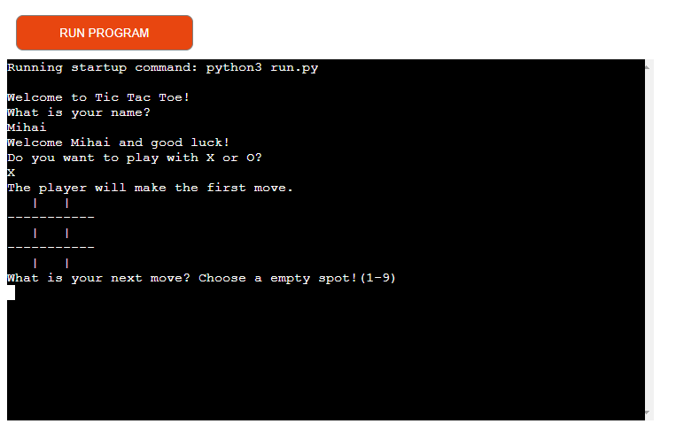
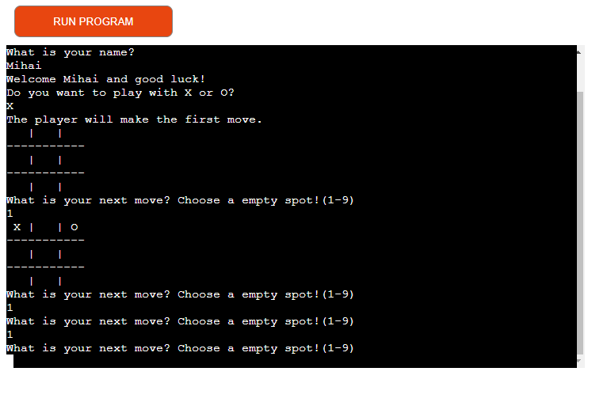
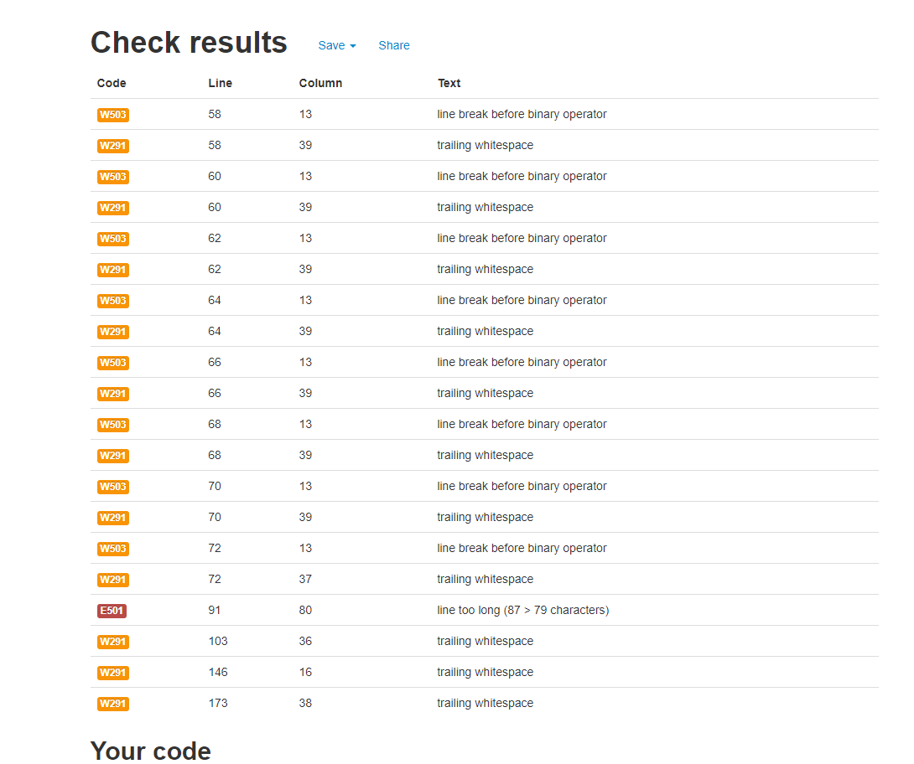

# Tic Tac Toe

Tic Tac Toe game is a Python terminal game wich runs in the mock terminal on Heroku

User needs to try to have identical symbols on a row, column or diagonal and beat the computer

[Live version of the game](https://tic-tac-toe-game-mihai.herokuapp.com/)

# How to play

Tic Tac Toe is a game in which two players take turns in drawing either an  O or an X in one square of a grid consisting of nine squares. The winner is the first player to get three of the same symbols in a row.

In this Game you will play against the computer. 
The winner is the player who have identical symbols on a row, column or diagonal.

# Features

## Existing Features

* Board generation 
* Choose the symbol that you want to play

* Play against the computer
* Accepts user input
* Maintain inputs on the board
* Input validation
    * You must enter numbers  
    * You cannot enter the same grid number twice
    
* Computer blocks the players next move if possible if the player is about to win on the next move

# Testing 

I have manually tested the game doing the following:
* Passed the code through a PEP8 linter and cofirmed there are no problems with the code only some line breakes wicth does not affect the code

* Given invalid inputs
* Tested on my local terminal and on Heroku terminal

# Bugs

## Solved Bugs

* When I wrote the code I was getting an error because I didn`t changet the user input to an iteger

# Deployment
This project was deplyed using mock terminal for Heroku
* Steps for deployment
    * Fork or clone repository
    * Create a new Heroku app
    * Set the buildbacks to Python and NodeJS in that order
    * Link the Heroku app to the repository
    * Click on Deploy

